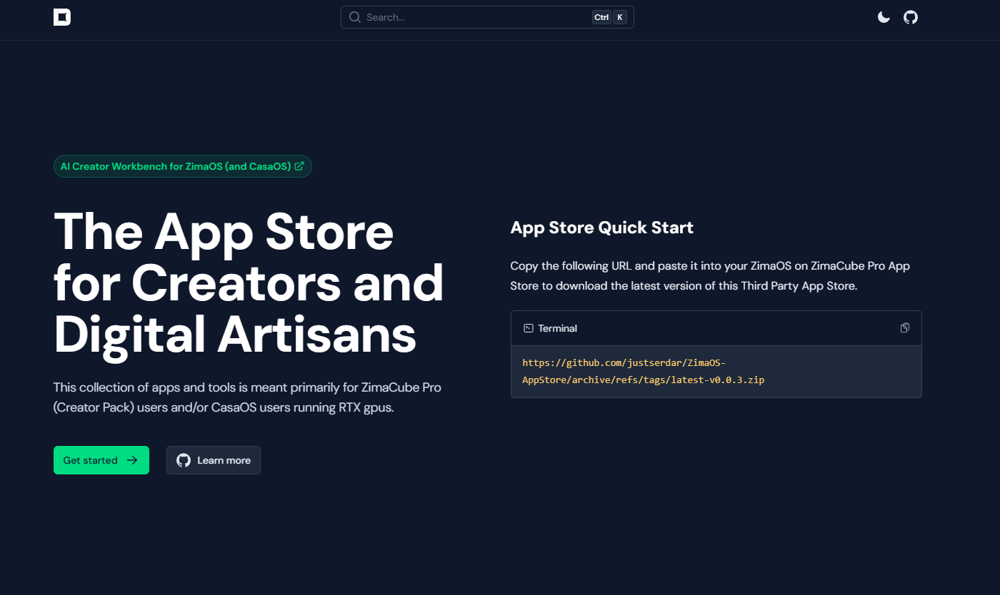
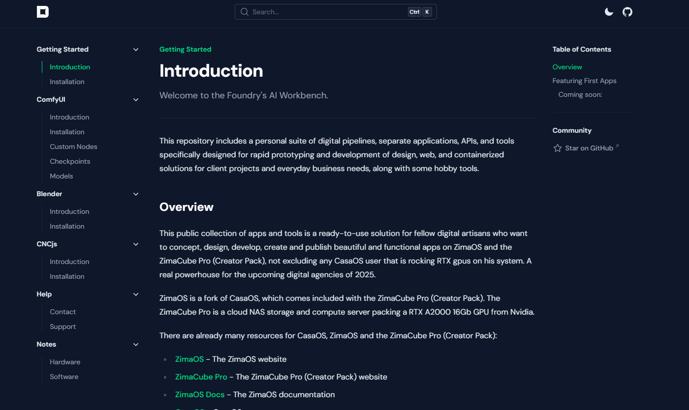
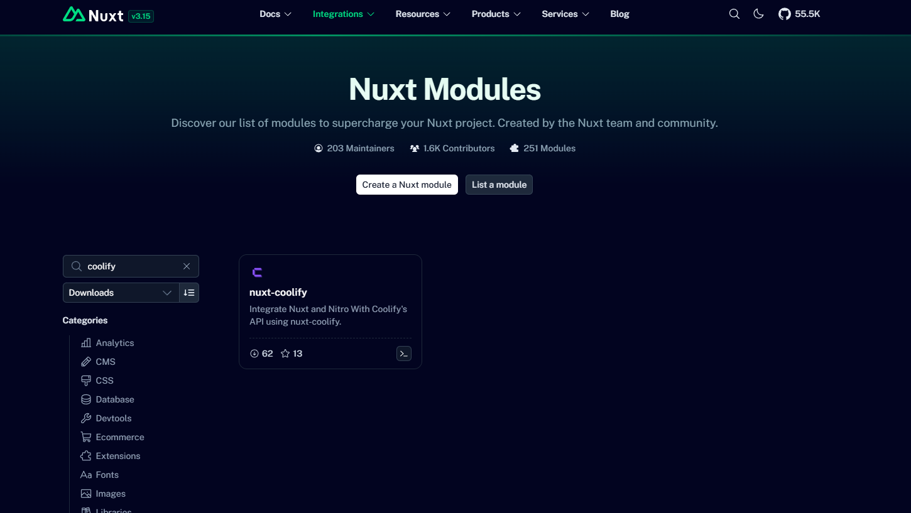

# Third Party Generative AI AppStore for ZimaOS (& CasaOS)

Your go-to App Store for Generative AI apps for CasaOS and ZimaOS devices like the [ZimaCube Pro](https://www.zimaspace.com/products/cube-personal-cloud?utm_source=homepage&utm_medium=banner) sporting a RTX A2000 GPU.

## For who is this Third party App Store?

Creative professionals, marketing teams, developers, and designers looking to leverage Generative AI apps on their ZimaCube Pro or local GPU-enabled CasaOS systems will find these tools ideal for jumpstarting projects and saving time in collaborative, real-time environments. These one-click apps are designed for easy installation and management post-setup. However, setting up and running these applications properly can still be quite challenging, so I did that for the users.

I value your time and want to enable you to get started in an eye-blink with Generative AI apps. One of my personal core missions is to make fundamental design processes more accessible to the general public.

Streamlining your content generation workflow, pipelines is just one of my specialties.
Read more about me [here](https://justserdar.dev/about).
My business is called [Darweb](https://darweb.nl/)
Professional portfolio& showcase: [Contra](https://contra.com/JustSerdarDev)

## Third party App store featuring Generative AI apps currently in active use and development on my ZimaCube Pro running ZimaOS.

Since I'm targeting my ZimaCube Pro product for my own business needs as a one stop shop digital content house, these apps are not primarily built for CasaOS but everything is compatible with CasaOS.

Like at the start of the [zimaos-coolify research](https://github.com/justserdar/zimaos-coolify), I document all of it so you can reproduce everything I so far yourself.

Note: You can read the original forked [CasaOS AppStore](#casaos-appstore) readme below.

## Documentation

I dedicated a subdomain with a blog and docs area for this App Store called the [Foundry Workbench](https://workbench.justserdar.dev/).

## Planned Apps

- *Pinikio*
- *Houdini* (Requires a Yearly SideVFX license to use)
- *ElizaOS*
- *StabilityMatrix*

## Future support

A update manager is coming soon to the App Store, I will be using Nuxt.js to build the frontend and TailwindCSS for styling.

- Like my official [nuxt-coolify](https://github.com/justserdar/nuxt-coolify) module for Nuxt.js, I will be wrapping the [ZimaOS API](https://www.zimaspace.com/docs/zimaos/OpenAPI-Live-Preview) into a [Nuxt module](https://nuxt.com/modules) too allow communication in realtime with the hardware from within the frontend. This allows us to streamline updating and handling apps on ZimaOS (rebuild nature of RAUC). CasaOS doesn't need this because it's a rolling release system.

This `ZimaOS update manager` using Nuxt and the ZimaOS API will help you ease the migration of my containers from one version of ZimaOS to another. Since a caveat, you lose your apps and data when you migrate to a newest version of ZimaOS, everytime, unlike CasaOS.

Stay tuned for more updates!

### Custom Nuxt apps on the dashboard

I'm working on a open-source custom Nuxt template app that will allow you to manage your apps on the dashboard via a docker container.

## CasaOS AppStore

 

CasaOS AppStore needs your help to grow.

## 3-Party AppStores

CasaOS allows you to customize your device with a variety of third-party app stores. Below, you'll find a collection of third-party app store links that you can add to your CasaOS device to expand your app selection and enhance your user experience. 

Simply copy the provided source link and add it to your CasaOS settings to access the corresponding app store.

- [Awesome Store list](https://awesome.casaos.io/content/3rd-party-app-stores/list.html)

## Contributors

<!-- ALL-CONTRIBUTORS-LIST:START - Do not remove or modify this section -->
<!-- prettier-ignore-start -->
<!-- markdownlint-disable -->

<!-- markdownlint-restore -->
<!-- prettier-ignore-end -->

<!-- ALL-CONTRIBUTORS-LIST:END -->
